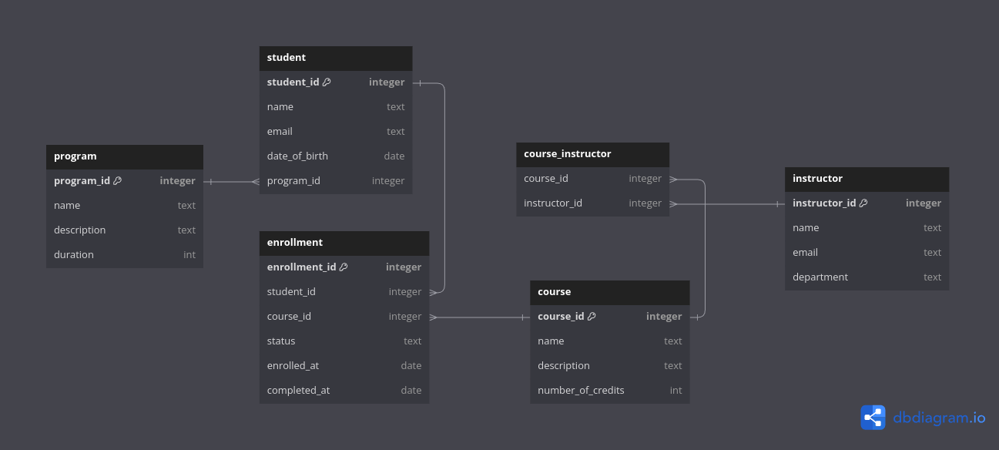

## Data Model



## DBML code
### Student Table

```dbml
Table student {
  student_id integer [pk]
  name text
  email text
  date_of_birth date
  program_id integer [ref: > program.program_id]
}
```

### Program Table

```dbml
Table program {
  program_id integer [pk]
  name text
  description text
  duration int
}
```

### Course Table

```dbml
Table course {
  course_id integer [pk]
  name text
  description text
  number_of_credits int
}
```

### Instructor Table

```dbml
Table instructor {
  instructor_id integer [pk]
  name text
  email text
  department text
}
```

### Enrollment Table

```dbml
Table enrollment {
  enrollment_id integer [pk]
  student_id integer [ref: > student.student_id]
  course_id integer [ref: > course.course_id]
  status text
  enrolled_at date
  completed_at date
}
```

### Course Instructor Table

```dbml
Table course_instructor {
  course_id integer [ref: > course.course_id]
  instructor_id integer [ref: > instructor.instructor_id]
}
```
